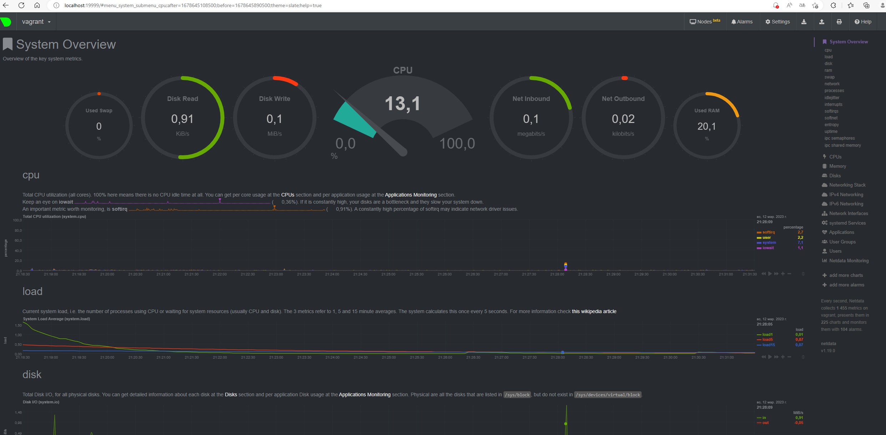

# Практическое задание по теме «Операционные системы 2»

1. На лекции мы познакомились с [node_exporter](https://github.com/prometheus/node_exporter/releases). В демонстрации его исполняемый файл запускался в background. Этого достаточно для демо, но не для настоящей production-системы, где процессы должны находиться под внешним управлением. Используя знания из лекции по systemd, создайте самостоятельно простой [unit-файл](https://www.freedesktop.org/software/systemd/man/systemd.service.html) для node_exporter:

    * поместите его в автозагрузку,
    * предусмотрите возможность добавления опций к запускаемому процессу через внешний файл (посмотрите, например, на `systemctl cat cron`),
    * удостоверьтесь, что с помощью systemctl процесс корректно стартует, завершается, а после перезагрузки автоматически поднимается.

На [странице](https://prometheus.io/download/#node_exporter) копируем путь для скачивания актуальной версии `node_exporter` и распаковываем его: 

```bash
vagrant@vagrant:~$ wget https://github.com/prometheus/node_exporter/releases/download/v1.3.0/node_exporter-1.3.0.linux-amd64.tar.gz
vagrant@vagrant:~$ tar xvfz node_exporter-1.3.0.linux-amd64.tar.gz
```

Для запуска демона `node_exporter` создадим системного пользовтеля `node_exporter`:

```bash
vagrant@vagrant:~$ sudo useradd -r -M -s /bin/false node_exporter
 ```

Создадим новый unit-файл и настроим его для `node_exporter`:

```bash
sudo nano /etc/systemd/system/node_exporter.service

[Unit]
Description=Prometheus Node Exporter
Wants=network-online.target
After=network-online.target

[Service]
User=node_exporter
Group=node_exporter
Type=simple
ExecStart=/home/vagrant/node_exporter-1.3.0.linux-amd64/node_exporter $EXTRA_OPTS

[Install]
WantedBy=multi-user.target
```

Сохраним файл. Затем запустим созданный сервис:

```bash
vagrant@vagrant:~$ sudo systemctl daemon-reload
vagrant@vagrant:~$ sudo systemctl enable --now node_exporter.service
```

Так как node_exporter использует по умолчанию 9100 порт, его необходимо открыть:

```bash
vagrant@vagrant:~$ sudo iptables -A INPUT -p tcp --dport 9100 -j ACCEPT
```

Проверяем статус сервиса `node_exporter`: 

```bash
vagrant@vagrant:~$ sudo systemctl status node_exporter.service

● node_exporter.service - Prometheus Node Exporter
     Loaded: loaded (/etc/systemd/system/node_exporter.service; enabled; vendor preset: enabled)
     Active: active (running) since Sun 2021-11-28 19:42:26 UTC; 4s ago
   Main PID: 13152 (node_exporter)
      Tasks: 4 (limit: 2278)
     Memory: 2.3M
     CGroup: /system.slice/node_exporter.service
             └─13152 /home/vagrant/0304/node_exporter-1.3.0.linux-amd64/node_exporter

Nov 28 19:42:26 vagrant node_exporter[13152]: ts=2021-11-28T19:42:26.049Z caller=node_exporter.go:115 level=info collector=thermal_zone
Nov 28 19:42:26 vagrant node_exporter[13152]: ts=2021-11-28T19:42:26.049Z caller=node_exporter.go:115 level=info collector=time
...
```

Для проверки работы сервиса перезагрузил машину командой `sudo reboot`. После перезагрузки сервис `node_exporter` был в статусе `active`.

---

2. Изучите опции node_exporter и вывод`/metrics` по-умолчанию. Приведите несколько опций, которые вы бы выбрали для базового мониторинга хоста по CPU, памяти, диску и сети.

CPU (`curl http://localhost:9100/metrics | grep node_cpu`):

* `node_cpu_seconds_total{cpu="0",mode="system"}` — время выполнения процессов, которые выполняются в режиме ядра.
* `node_cpu_seconds_total{cpu="0",mode="user"}` — время выполнения обычных процессов, которые выполняются в режиме пользователя.

Память (`curl http://localhost:9100/metrics | grep node_memory`):

* `node_memory_MemTotal_bytes` — общий объем памяти на машине.
* `node_memory_MemFree_bytes` — объем свободной памяти, оставшийся в системе, не включая кэш и буферы, которые могут быть очищены/освобождены.

Диск (`curl http://localhost:9100/metrics | grep node_disk`):

* `node_disk_read_time_seconds_total` — количество секунд, затраченных на чтение.
* `node_disk_io_now` — количество операций ввода-вывода (I/O), выполняемых в настоящий момент.

Сеть (`curl http://localhost:9100/metrics | grep node_network`):

* `node_network_receive_bytes_total` — объем полученных данных (в байтах).
* `node_network_receive_errs_total` — количество возникших ошибок при получении.

---

3. Установите в свою виртуальную машину [Netdata](https://github.com/netdata/netdata). Воспользуйтесь [готовыми пакетами](https://packagecloud.io/netdata/netdata/install) для установки (`sudo apt install -y netdata`). После успешной установки:
    * в конфигурационном файле `/etc/netdata/netdata.conf` в секции [web] замените значение с localhost на `bind to = 0.0.0.0`,
    * добавьте в Vagrantfile проброс порта Netdata на свой локальный компьютер и сделайте `vagrant reload`:

    ```bash
    config.vm.network "forwarded_port", guest: 19999, host: 19999
    ```

    После успешной перезагрузки в браузере *на своем ПК* (не в виртуальной машине) вы должны суметь зайти на `localhost:19999`. Ознакомьтесь с метриками, которые по умолчанию собираются Netdata и с комментариями, которые даны к этим метрикам.

Установил Netdata: `sudo apt install -y netdata`.

Настроил `/etc/netdata/netdata.conf` и `Vagrantfile`.

После перезагрузи дашборд Netdata доступен на локальном устройстве: 



---

4. Можно ли по выводу `dmesg` понять, осознает ли ОС, что загружена не на настоящем оборудовании, а на системе виртуализации?

Есть строка: 

```bash
Hypervisor detected: KVM
```

, где KVM — Kernel-based Virtual Machine.

---

5. Как настроен sysctl `fs.nr_open` на системе по-умолчанию? Узнайте, что означает этот параметр. Какой другой существующий лимит не позволит достичь такого числа (`ulimit --help`)?

```bash
vagrant@vagrant:~$ sysctl --all | grep nr_open

fs.nr_open = 1048576
```

`fs.nr_open` – максимальное количество файловых дескрипторов, которое может выделить процесс. Значение по умолчанию - 1024 * 1024 (1048576).

```bash
vagrant@vagrant:~$ ulimit -n

1024
```

`ulimit -n = 1024` не позволит достичь такого числа.

---

6. Запустите любой долгоживущий процесс (не `ls`, который отработает мгновенно, а, например, `sleep 1h`) в отдельном неймспейсе процессов; покажите, что ваш процесс работает под PID 1 через `nsenter`. Для простоты работайте в данном задании под root (`sudo -i`). Под обычным пользователем требуются дополнительные опции (`--map-root-user`) и т.д.

Все действия выполняем под `root`: (`sudo -i`):

В `/dev/pts/1`:

Создаём namespace для процесса `sleep 1h`:
```bash
root@vagrant:~$ unshare -f --pid --mount-proc sleep 1h &

[1] 1446
```

В `/dev/pts/0`: 

```bash
root@vagrant:~$ nsenter --target 1446 --pid --mount
root@vagrant:~$ ps aux | grep sleep

root           1  0.0  0.0   9828   592 pts/1    S+   20:18   0:00 sleep 1h
root          24  0.0  0.0  10760   740 pts/0    S+   20:21   0:00 grep --color=auto sleep
```

Как видим процесс `sleep 1h` имеет PID 1.

---

7. Найдите информацию о том, что такое `:(){ :|:& };:`. Запустите эту команду в своей виртуальной машине Vagrant с Ubuntu 20.04 (**это важно, поведение в других ОС не проверялось**). Некоторое время все будет "плохо", после чего (минуты) – ОС должна стабилизироваться. Вызов `dmesg` расскажет, какой механизм помог автоматической стабилизации. Как настроен этот механизм по-умолчанию, и как изменить число процессов, которое можно создать в сессии?

Это функция на баше, которая вызывает саму себя дважды. Fork-bomb!

```bash
:()
{
    :|:&
};
:
```

Число процессов указано в `ulimit -u`: 7595. Задать можно: `ulimit -u <n>`.