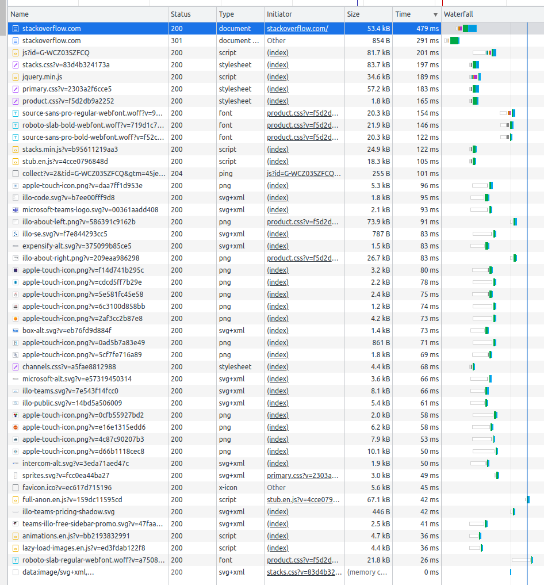

# Домашнее задание к занятию «Компьютерные сети. Лекция 1»

### Цель задания

В результате выполнения задания вы: 

* научитесь работать с HTTP-запросами, чтобы увидеть, как клиенты взаимодействуют с серверами по этому протоколу;
* поработаете с сетевыми утилитами, чтобы разобраться, как их можно использовать для отладки сетевых запросов, соединений.

### Чеклист готовности к домашнему заданию

1. Убедитесь, что у вас установлены необходимые сетевые утилиты — dig, traceroute, mtr, telnet.
2. Используйте `apt install` для установки пакетов.


### Инструкция к заданию

1. Создайте .md-файл для ответов на вопросы задания в своём репозитории, после выполнения прикрепите ссылку на него в личном кабинете.
2. Любые вопросы по выполнению заданий задавайте в чате учебной группы или в разделе «Вопросы по заданию» в личном кабинете.


### Дополнительные материалы для выполнения задания

1. Полезным дополнением к обозначенным выше утилитам будет пакет net-tools. Установить его можно с помощью команды `apt install net-tools`.
2. RFC протокола HTTP/1.0, в частности [страница с кодами ответа](https://www.rfc-editor.org/rfc/rfc1945#page-32).
3. [Ссылки на другие RFC для HTTP](https://blog.cloudflare.com/cloudflare-view-http3-usage/).

------

## Задание

**Шаг 1.** Работа c HTTP через telnet.

- Подключитесь утилитой telnet к сайту stackoverflow.com:

`telnet stackoverflow.com 80`
 
- Отправьте HTTP-запрос:

```bash
GET /questions HTTP/1.0
HOST: stackoverflow.com
[press enter]
[press enter]
```
*В ответе укажите полученный HTTP-код и поясните, что он означает.*
```bash
Trying 151.101.129.69...
Connected to stackoverflow.com.
Escape character is '^]'.
GET /questions HTTP/1.0
HOST: stackoverflow.com

HTTP/1.1 403 Forbidden
Connection: close
Content-Length: 1926
Server: Varnish
Retry-After: 0
Content-Type: text/html
Accept-Ranges: bytes
Date: Wed, 05 Apr 2023 18:06:08 GMT
Via: 1.1 varnish
X-Served-By: cache-hel1410030-HEL
X-Cache: MISS
X-Cache-Hits: 0
X-Timer: S1680717969.702899,VS0,VE1
X-DNS-Prefetch-Control: off
```
403 Forbidden - Запрещено, возможно связано с настройками веб-сервера и необходимо передавать в запросе User-Agent
```bash
GET /questions HTTP/1.1
Host: stackoverflow.com
User-Agent: telnet?
Accept: */*

HTTP/1.1 301 Moved Permanently
Connection: keep-alive
cache-control: private
location: https://stackoverflow.com/questions
x-request-guid: 85744caa-c59d-47e5-b13f-5bc22b4a890a
set-cookie: prov_tgt=; expires=Mon, 03 Apr 2023 18:16:29 GMT; domain=.stackoverflow.com; path=/; secure; samesite=none; httponly
feature-policy: microphone 'none'; speaker 'none'
content-security-policy: upgrade-insecure-requests; frame-ancestors 'self' https://stackexchange.com
Accept-Ranges: bytes
Date: Wed, 05 Apr 2023 18:16:29 GMT
Via: 1.1 varnish
X-Served-By: cache-hel1410023-HEL
X-Cache: MISS
X-Cache-Hits: 0
X-Timer: S1680718589.445554,VS0,VE221
Vary: Fastly-SSL
X-DNS-Prefetch-Control: off
Set-Cookie: prov=45ccc67d-700f-28b7-116f-1be9531b6344; domain=.stackoverflow.com; expires=Fri, 01-Jan-2055 00:00:00 GMT; path=/; HttpOnly
transfer-encoding: chunked
```
Теперь Код ответа 301 (Moved Permanently) означает что страница перемещена на новый адрес, а старый (те текущий) следует считать устаревшим. Новый адрес: https://stackoverflow.com/questions

**Шаг 2.** Повторите задание 1 в браузере, используя консоль разработчика F12:

 - откройте вкладку `Network`;
 - отправьте запрос [http://stackoverflow.com](http://stackoverflow.com);
 - найдите первый ответ HTTP-сервера, откройте вкладку `Headers`;
 - укажите в ответе полученный HTTP-код;
 - проверьте время загрузки страницы и определите, какой запрос обрабатывался дольше всего;
 - приложите скриншот консоли браузера в ответ.
```bash
Request URL: http://stackoverflow.com/
Request Method: GET
Status Code: 301 Moved Permanently
Remote Address: 151.101.65.69:80
Referrer Policy: strict-origin-when-cross-origin
```
Наиболее продолжительные запросы: 



**Шаг 3.** Какой IP-адрес у вас в интернете?
```bash
curl ifconfig.me
109.167.136.1**
```

**Шаг 4.** Какому провайдеру принадлежит ваш IP-адрес? Какой автономной системе AS? Воспользуйтесь утилитой `whois`.
```bash
% Information related to '109.167.128.0/19AS25408'

route:          109.167.128.0/19
descr:          WestCall-NET
origin:         AS25408
mnt-by:         WESTCALLSPB-MNT-RIPE
mnt-by:         WESTCALLSPB-MNT-RIPE
created:        2022-04-05T13:33:31Z
last-modified:  2022-04-05T13:47:01Z
source:         RIPE
```
**Шаг 5.** Через какие сети проходит пакет, отправленный с вашего компьютера на адрес 8.8.8.8? Через какие AS? Воспользуйтесь утилитой `traceroute`.
```bash
Через traceroute не прилетает ответ с узлов(хопов) сделаю через mtr
```

**Шаг 6.** Повторите задание 5 в утилите `mtr`. На каком участке наибольшая задержка — delay?
```bash
4й хоп, грёбаный interzet :)
```

**Шаг 7.** Какие DNS-сервера отвечают за доменное имя dns.google? Какие A-записи? Воспользуйтесь утилитой `dig`.
```bash
DNS-servers: 
;; ANSWER SECTION:
dns.google.		5	IN	NS	ns4.zdns.google.
dns.google.		5	IN	NS	ns1.zdns.google.
dns.google.		5	IN	NS	ns3.zdns.google.
dns.google.		5	IN	NS	ns2.zdns.google.
```
```bash
A-zapisi:
;; ANSWER SECTION:
dns.google.		5	IN	A	8.8.4.4
dns.google.		5	IN	A	8.8.8.8

```
**Шаг 8.** Проверьте PTR записи для IP-адресов из задания 7. Какое доменное имя привязано к IP? Воспользуйтесь утилитой `dig`.
```bash
;; ANSWER SECTION:
ns2.zdns.google.	5	IN	A	216.239.34.114
ns3.zdns.google.	5	IN	A	216.239.36.114
ns4.zdns.google.	5	IN	A	216.239.38.114
ns1.zdns.google.	5	IN	A	216.239.32.114

```
*В качестве ответов на вопросы приложите лог выполнения команд в консоли или скриншот полученных результатов.*

----

### Правила приёма домашнего задания

В личном кабинете отправлена ссылка на .md-файл в вашем репозитории.


### Критерии оценки

Зачёт:

* выполнены все задания;
* ответы даны в развёрнутой форме;
* приложены соответствующие скриншоты и файлы проекта;
* в выполненных заданиях нет противоречий и нарушения логики.

На доработку:

* задание выполнено частично или не выполнено вообще;
* в логике выполнения заданий есть противоречия и существенные недостатки. 