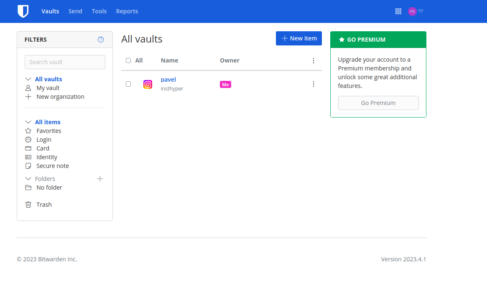
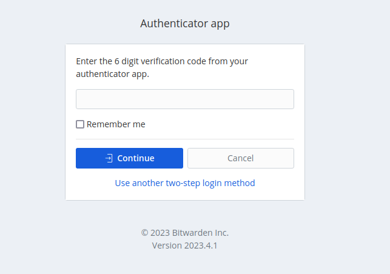
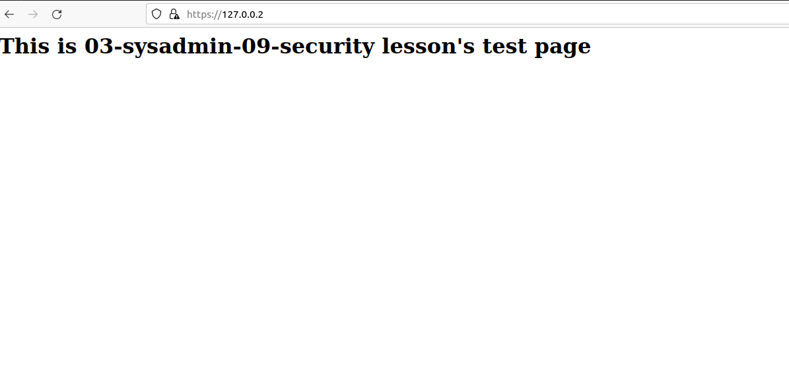
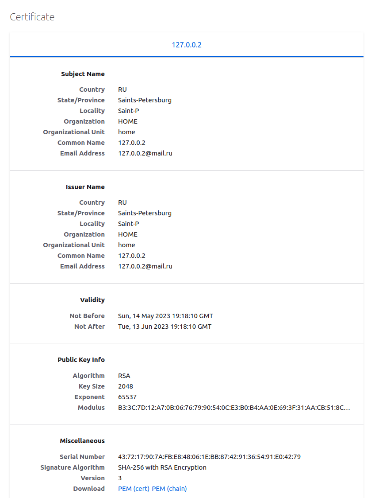
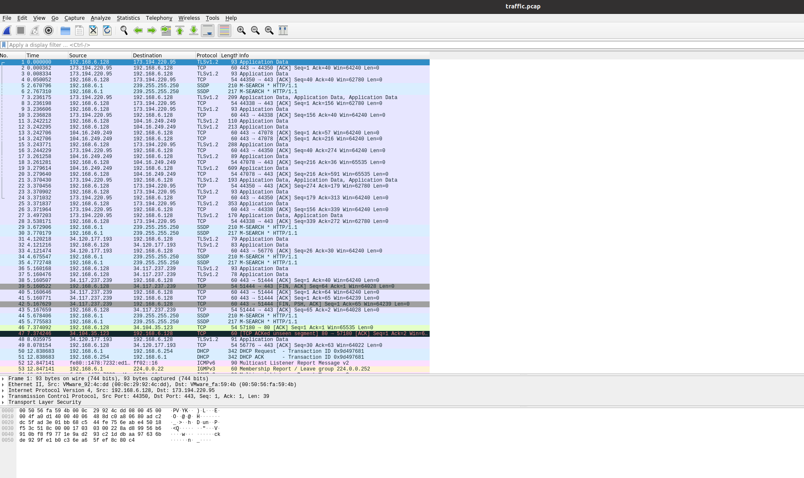

# Практическое задание по теме «Элементы безопасности информационных систем»

1. Установите Bitwarden плагин для браузера. Зарегестрируйтесь и сохраните несколько паролей.

Установил плагин, добавил аккаунт Instagram.com:



---
2. Установите Google authenticator на мобильный телефон. Настройте вход в Bitwarden акаунт через Google authenticator OTP.

Настроил вход через Google authenticator OTP:



---

3. Установите apache2, сгенерируйте самоподписанный сертификат, настройте тестовый сайт для работы по HTTPS.

Для генерации файлов сертификата использовали пакет `openssl`: 

```bash
root@ubuntu:/etc/apache2/sites-available# openssl req -new -x509 -days 30 -keyout apache2-example.key -out sapache2-example.pem
root@ubuntu:/etc/apache2/sites-available# sudo cp apache2-example.pem /etc/ssl/certs/
root@ubuntu:/etc/apache2/sites-available# sudo cp apache2-example.key /etc/ssl/private/
```
HTML-страница `127.0.0.2`:
```bash
root@ubuntu:/etc/apache2/sites-available# cat /var/www/127.0.0.2/index.html 
<html>
	<head>
		<title>03-sysadmin-09-security</title>
	</head>
	<body>
          	<h1>This is <b>03-sysadmin-09-security lesson's</b> test page</h1>
	</body>
</html>
```
Conf-файл Apache2 для страницы `127.0.0.2`, (указали пути для файлов сертификата):

```bash
root@ubuntu:/etc/apache2/sites-available# cat /etc/apache2/sites-available/127.0.0.2.conf

<VirtualHost *:443>
   ServerName 127.0.0.2
   DocumentRoot /var/www/127.0.0.2

   SSLEngine on
   SSLCertificateFile /etc/ssl/certs/apache2-example.pem
   SSLCertificateKeyFile /etc/ssl/private/apache2-example.key
</VirtualHost>
```
После перезагрузки сервиса apache2 и ввода pass phrase можно переходить по адресу `https://127.0.0.2/`: 

Информация о сертификате:

---
4. Проверьте на TLS уязвимости произвольный сайт в интернете (кроме сайтов МВД, ФСБ, МинОбр, НацБанк, РосКосмос, РосАтом, РосНАНО и любых госкомпаний, объектов КИИ, ВПК ... и тому подобное).

Проверил сайт Apple:
```bash
root@ubuntu:/etc/apache2/sites-available# testssl -U --sneaky https://www.apple.com/

###########################################################
    testssl.sh       3.0.4 from https://testssl.sh/

      This program is free software. Distribution and
             modification under GPLv2 permitted.
      USAGE w/o ANY WARRANTY. USE IT AT YOUR OWN RISK!

       Please file bugs @ https://testssl.sh/bugs/

###########################################################

 Using "OpenSSL 1.0.2-chacha (1.0.2k-dev)" [~183 ciphers]
 on ubuntu:/snap/testssl/20/bin/openssl.Linux.x86_64
 (built: "Jan 18 17:12:17 2019", platform: "linux-x86_64")


 Start 2023-05-14 12:38:17        -->> 92.122.109.22:443 (www.apple.com) <<--

 Further IP addresses:   2a02:2d8:3:9ac::1aca 2a02:2d8:3:999::1aca 
 rDNS (92.122.109.22):   a92-122-109-22.deploy.static.akamaitechnologies.com.
 Service detected:       HTTP


 Testing vulnerabilities 

 Heartbleed (CVE-2014-0160)                not vulnerable (OK), no heartbeat extension
 CCS (CVE-2014-0224)                       not vulnerable (OK)
 Ticketbleed (CVE-2016-9244), experiment.  not vulnerable (OK)
 ROBOT                                     not vulnerable (OK)
 Secure Renegotiation (RFC 5746)           supported (OK)
 Secure Client-Initiated Renegotiation     not vulnerable (OK)
 CRIME, TLS (CVE-2012-4929)                not vulnerable (OK)
 BREACH (CVE-2013-3587)                    potentially NOT ok, "gzip" HTTP compression detected. - only supplied "/" tested
                                           Can be ignored for static pages or if no secrets in the page
 POODLE, SSL (CVE-2014-3566)               not vulnerable (OK)
 TLS_FALLBACK_SCSV (RFC 7507)              Downgrade attack prevention supported (OK)
 SWEET32 (CVE-2016-2183, CVE-2016-6329)    not vulnerable (OK)
 FREAK (CVE-2015-0204)                     not vulnerable (OK)
 DROWN (CVE-2016-0800, CVE-2016-0703)      not vulnerable on this host and port (OK)
                                           make sure you don't use this certificate elsewhere with SSLv2 enabled services
                                           https://censys.io/ipv4?q=9875BB8EE57179BF042F3C94E6F178D141EE4DD15BDE078B1EC026ED2DAE6FF2 could help you to find out
 LOGJAM (CVE-2015-4000), experimental      not vulnerable (OK): no DH EXPORT ciphers, no DH key detected with <= TLS 1.2
 BEAST (CVE-2011-3389)                     TLS1: ECDHE-RSA-AES256-SHA ECDHE-RSA-AES128-SHA AES256-SHA AES128-SHA 
                                           VULNERABLE -- but also supports higher protocols  TLSv1.1 TLSv1.2 (likely mitigated)
 LUCKY13 (CVE-2013-0169), experimental     potentially VULNERABLE, uses cipher block chaining (CBC) ciphers with TLS. Check patches
 RC4 (CVE-2013-2566, CVE-2015-2808)        no RC4 ciphers detected (OK)
```
Строка говорит о возможной уязвимости:
```bash
LUCKY13 (CVE-2013-0169), experimental     potentially VULNERABLE, uses cipher block chaining (CBC) ciphers with TLS. Check patches
```
---
5. Установите на Ubuntu ssh сервер, сгенерируйте новый приватный ключ. Скопируйте свой публичный ключ на другой сервер. Подключитесь к серверу по SSH-ключу.

Для выполнения задания был использовано 2 сервера:
- Win 10 (локальная машина)
- VirtualBox Ubuntu 20.04 (виртуальная машина)

**VirtualBox Ubuntu 20.04**

Установим `ssh`:

```bash
root@ubuntu:/etc/apache2/sites-available# sudo apt install openssh-server
root@ubuntu:/etc/apache2/sites-available# sudo systemctl enable ssh
```

Выясним ip–адрес:

```bash
root@ubuntu:/etc/apache2/sites-available# ip addr show
1: lo: <LOOPBACK,UP,LOWER_UP> mtu 65536 qdisc noqueue state UNKNOWN group default qlen 1000
    link/loopback 00:00:00:00:00:00 brd 00:00:00:00:00:00
    inet 127.0.0.1/8 scope host lo
       valid_lft forever preferred_lft forever
    inet6 ::1/128 scope host 
       valid_lft forever preferred_lft forever
2: ens33: <BROADCAST,MULTICAST,UP,LOWER_UP> mtu 1500 qdisc fq_codel state UP group default qlen 1000
    link/ether 00:0c:29:92:4c:dd brd ff:ff:ff:ff:ff:ff
    altname enp2s1
    inet 192.168.6.128/24 brd 192.168.6.255 scope global dynamic noprefixroute ens33
       valid_lft 1162sec preferred_lft 1162sec
    inet6 fe80::f42b:dd82:3643:3f18/64 scope link noprefixroute 
       valid_lft forever preferred_lft forever

...
```

Адрес: `192.168.6.128`.

**Win 10**

Затем из локального устройства скопируем публичный ключ на виртуальную машину:

```bash
PS C:\Users\dream\.ssh>  type $env:USERPROFILE\.ssh\id_rsa.pub | ssh pavel@192.168.6.128 "cat >> .ssh/authorized_keys"
pavel@192.168.6.128's password:
Permission denied, please try again.
pavel@192.168.6.128's password:
PS C:\Users\dream\.ssh> ssh pavel@192.168.6.128
Welcome to Ubuntu 20.04.6 LTS (GNU/Linux 5.15.0-71-generic x86_64)

 * Documentation:  https://help.ubuntu.com
 * Management:     https://landscape.canonical.com
 * Support:        https://ubuntu.com/advantage

Expanded Security Maintenance for Applications is not enabled.

1 update can be applied immediately.
To see these additional updates run: apt list --upgradable

19 additional security updates can be applied with ESM Apps.
Learn more about enabling ESM Apps service at https://ubuntu.com/esm

New release '22.04.2 LTS' available.
Run 'do-release-upgrade' to upgrade to it.

Your Hardware Enablement Stack (HWE) is supported until April 2025.
Last login: Sat Sep 24 03:29:32 2022 from 192.168.0.101
pavel@ubuntu:~$
```
---
6. Переименуйте файлы ключей из задания 5. Настройте файл конфигурации SSH клиента, так чтобы вход на удаленный сервер осуществлялся по имени сервера.

Настроим файл конфигурации:

**WIN10**
создаем файл config в папке .ssh и добавляем туда
```bash
Host vm-ubuntu
	HostName 192.168.6.128
	IdentityFile ~/.ssh/id_rsa
	User pavel
```

Заходим на `vm-ubuntu`:

```bash
PS C:\Users\dream\.ssh> ssh vm-ubuntu
Welcome to Ubuntu 20.04.6 LTS (GNU/Linux 5.15.0-71-generic x86_64)

 * Documentation:  https://help.ubuntu.com
 * Management:     https://landscape.canonical.com
 * Support:        https://ubuntu.com/advantage

Expanded Security Maintenance for Applications is not enabled.

1 update can be applied immediately.
To see these additional updates run: apt list --upgradable

19 additional security updates can be applied with ESM Apps.
Learn more about enabling ESM Apps service at https://ubuntu.com/esm

New release '22.04.2 LTS' available.
Run 'do-release-upgrade' to upgrade to it.

Your Hardware Enablement Stack (HWE) is supported until April 2025.
Last login: Sun May 14 12:56:30 2023 from 192.168.6.1
```
---
7. Соберите дамп трафика утилитой tcpdump в формате pcap, 100 пакетов. Откройте файл pcap в Wireshark.

Соберём трафик:
```bash
root@ubuntu:/home/pavel# sudo tcpdump -w traffic.pcap -c 100
tcpdump: listening on ens33, link-type EN10MB (Ethernet), capture size 262144 bytes
100 packets captured
106 packets received by filter
0 packets dropped by kernel
```
Файл traffic.pcap, открытый в Wireshark:
