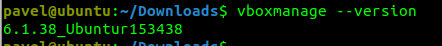
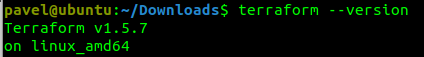
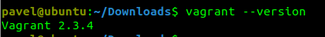
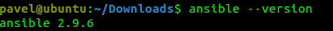
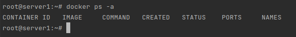

## Задача 1

- Опишите основные преимущества применения на практике IaaC-паттернов.
- Какой из принципов IaaC является основополагающим?


 ***Ответ:***
1. Основные преимущества применения IaaC паттернов:
- **CI (Continuous Integration)** — принцип CI предполагает слияние рабочих веток в основную ветку и автоматизированную пересборку проекта и запуск тестов. Позволяет избавить разработчиков от ручных действий и выявлять проблемы сразу после пересборки.   
- **CD (Continuous Delivery)** — принцип CD (delivery) предполагает отправлять валидные доработки в dev-окружения по нажатию кнопки. В случае обнаружения проблем можно откатиться до предыдущей стабильной версии.
- **CD (Continuous Deployment)** — принцип CD (deployment) предполагает полную автоматизацию развёртывания доработок в dev-окружения. Однако релиз в production всё ещё в под ручным управлением, для минимизации бизнес-рисков.   

2. Основопологающим принципом IaaC является **индемпотентность**. Индемпотентность обеспечивает идентичный результат при повторном выполнении каких-либо операций.

## Задача 2

- Чем Ansible выгодно отличается от других систем управление конфигурациями?
- Какой, на ваш взгляд, метод работы систем конфигурации более надёжный — push или pull?

***Ответ:***
1. Ansible реализован как open source решение. Для корпоративного использования доступна проприетарная версия — Ansible Tower. Ansible поддерживает как декларативный, так и императивный подходы. Относительно низкий порог входа. В сети можно найти много примеров использования и подробную документацию.
2. Основная разница между методами push и pull заключается в том, кто инициирует изменения на гостевой машине. На мой взгляд, более надёжно использовать метод push. Это позволит избежать ситуации, когда десятки или сотни гостевых машин начинают одновременно запрашивать изменения с мастер-сервера.
## Задача 3

Установите на личный компьютер:

- [VirtualBox](https://www.virtualbox.org/),
- [Vagrant](https://github.com/netology-code/devops-materials),
- [Terraform](https://github.com/netology-code/devops-materials/blob/master/README.md),
- Ansible.







## Задача 4 

Воспроизведите практическую часть лекции самостоятельно.

- Создайте виртуальную машину.
- Зайдите внутрь ВМ, убедитесь, что Docker установлен с помощью команды
```
docker ps
```
***Ответ:***

