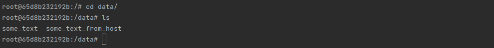

## Задача 1

Сценарий выполнения задачи:

- создайте свой репозиторий на https://hub.docker.com;
- выберите любой образ, который содержит веб-сервер Nginx;
- создайте свой fork образа;
- реализуйте функциональность:
запуск веб-сервера в фоне с индекс-страницей, содержащей HTML-код ниже:
```
<html>
<head>
Hey, Netology
</head>
<body>
<h1>I’m DevOps Engineer!</h1>
</body>
</html>
```

Опубликуйте созданный fork в своём репозитории и предоставьте ответ в виде ссылки на https://hub.docker.com/username_repo.
## Решение:
Создадим [Dockerfile](app/Dockerfile), в нём пропишем команду `COPY` для перезаписи стартовой страницы Nginx:

```docker
FROM nginx:latest
COPY ./index.html /usr/share/nginx/html/index.html
```

Построим Docker-образ `webserver`:

```bash
docker build -t webserver .
```

Проверим что он корректно загрузился:

```bash
REPOSITORY           TAG       IMAGE ID       CREATED          SIZE
webserver            latest    432ef824e3be   16 minutes ago   187MB
webserver            wbsrv1    432ef824e3be   16 minutes ago   187MB
pchvanin/webserver   111       432ef824e3be   16 minutes ago   187MB
hello-world          latest    9c7a54a9a43c   4 months ago     13.3kB
```

`IMAGE ID 432ef824e3be`

Запустим Docker-контейнер `netology` в фоновом режиме. Используем `8080` порт:

```docker
docker run -it --rm -d -p 8080:80 --name netology pchvanin/webserver:111
```

Откроем страницу на локальном устройстве:


Для загрузки в Docker Hub добавим тег `pchvanin/webserver:111`:

```bash
docker image tag webserver pchvanin/webserver:111
```

Опубликуем Docker-образ по адресу `pchvanin/webserver`:

```bash
docker image push pchvanin/webserver:111
```

Ссылка на Docker-образ: https://hub.docker.com/r/pchvanin/webserver
## Задача 2

Посмотрите на сценарий ниже и ответьте на вопрос:
«Подходит ли в этом сценарии использование Docker-контейнеров или лучше подойдёт виртуальная машина, физическая машина? Может быть, возможны разные варианты?»

Детально опишите и обоснуйте свой выбор.

--

Сценарий:

- высоконагруженное монолитное Java веб-приложение;
- Nodejs веб-приложение;
- мобильное приложение c версиями для Android и iOS;
- шина данных на базе Apache Kafka;
- Elasticsearch-кластер для реализации логирования продуктивного веб-приложения — три ноды elasticsearch, два logstash и две ноды kibana;
- мониторинг-стек на базе Prometheus и Grafana;
- MongoDB как основное хранилище данных для Java-приложения;
- Gitlab-сервер для реализации CI/CD-процессов и приватный (закрытый) Docker Registry.

## Решение:
1. Высоконагруженное монолитное Java веб-приложение;

Docker-контейнер удобен для реализации монолитного web-приложения. Высокая нагрузка не противоречит подходу к контенеризации. Вероятно с помощью контейнера можно будет распределять нагрузку.

2. Nodejs веб-приложение;

Для развёртывания web-приложения удобно использовать Docker-контейнер. Перед релизом контейнер можно запускать на dev- и test- средах для тестирования. Можно воспользоваться [готовым образом](https://hub.docker.com/_/node).

3. Мобильное приложение c версиями для Android и iOS;

Поверхностное изучение вопроса показало, что: 

* Android-проект можно контейнеризировать; 
* iOS — нельзя. 

В связи с чем предлагаю использовать виртуализацпю.

4. Шина данных на базе Apache Kafka; 

Для конфигурации Apache Kafka можно использовать Docker-контейнер. В случае необходимости разворачивать шину на других, более мощных, серверах Docker-контейнер можно перенести.

5. Elasticsearch кластер для реализации логирования продуктивного веб-приложения - три ноды elasticsearch, два logstash и две ноды kibana; 

Так как предлагается разворачивать несколько нод приложения, а так же все приведённые проекта имеют официальные образы в Docker Hub ([Elasticsearch](https://hub.docker.com/_/elasticsearch), [Logstash](https://hub.docker.com/_/logstash), [Kibana](https://hub.docker.com/_/kibana)) предлагаю использовать Docker-контейнер. При этом Elasticsearch должен быть stateful-приложением, так как это база данных.

6. Мониторинг-стек на базе Prometheus и Grafana; 

Prometheus и Grafana являются приложениями с web-интерфейсом. По сути те же web-приложения. В таких случаях удобно использовать Docker-контейнер.

7. MongoDB, как основное хранилище данных для Java-приложения; 

Для MongoDB так же можно использовать Docker-контейнер, например, с официального [образа](https://hub.docker.com/_/mongo). Как и в случае с Elasticsearch — это будет stateful-приложение, для сохранения данных после остановки контейнера. 

8. Gitlab сервер для реализации CI/CD процессов и приватный (закрытый) Docker Registry.

Gitlab сервер так же удобно разворачивать внутри Docker-контейнера. Такой контейнер легко переносить на различные машины, настраивать и тд.
## Задача 3

- Запустите первый контейнер из образа ***centos*** c любым тегом в фоновом режиме, подключив папку ```/data``` из текущей рабочей директории на хостовой машине в ```/data``` контейнера.
- Запустите второй контейнер из образа ***debian*** в фоновом режиме, подключив папку ```/data``` из текущей рабочей директории на хостовой машине в ```/data``` контейнера.
- Подключитесь к первому контейнеру с помощью ```docker exec``` и создайте текстовый файл любого содержания в ```/data```.
- Добавьте ещё один файл в папку ```/data``` на хостовой машине.
- Подключитесь во второй контейнер и отобразите листинг и содержание файлов в ```/data``` контейнера.
## Решение:
1. Запустите первый контейнер из образа ***centos*** c любым тэгом в фоновом режиме, подключив папку ```/data``` из текущей рабочей директории на хостовой машине в ```/data``` контейнера;

Добавим папку [data](IMG/data.png) в Docker File sharing:


Запустим **Centos**:

```bash
docker run -v /home/pavel/PycharmProjects/devops-netology/05-virt-03-docker/data:/data -t -d --name my_centos centos:latest

81f9b0301749c89a1ad70d2fa29bb5d32e9809aee543a6264a1cea6d858d248e
```

2. Запустите второй контейнер из образа ***debian*** в фоновом режиме, подключив папку ```/data``` из текущей рабочей директории на хостовой машине в ```/data``` контейнера; 

Запустим **Debian**:

```bash
docker run -v /home/pavel/PycharmProjects/devops-netology/05-virt-03-docker/data:/data -t -d --name my_debian debian:latest

65d8b232192bd61edd8645821dff08b148378f58e9f710b84f1fef0ad3fa1716
```

Проверим `docker ps`:

```bash
CONTAINER ID   IMAGE           COMMAND       CREATED          STATUS          PORTS     NAMES
65d8b232192b   debian:latest   "bash"        24 seconds ago   Up 23 seconds             my_debian
81f9b0301749   centos:latest   "/bin/bash"   2 minutes ago    Up 2 minutes              my_centos
```

3. Подключитесь к первому контейнеру с помощью ```docker exec``` и создайте текстовый файл любого содержания в ```/data```; 

```bash
docker exec -it my_centos /bin/bash
[root@81f9b0301749 /]# cd data/ 
[root@81f9b0301749 data]# echo "some text" > some_text 
[root@81f9b0301749 data]# ls
some_text
[root@81f9b0301749 data]# 
```

4. Добавьте еще один файл в папку ```/data``` на хостовой машине; 

```bash
echo "some text from host" > some_text_from_host
```

5. Подключитесь во второй контейнер и отобразите листинг и содержание файлов в ```/data``` контейнера.

