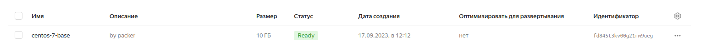
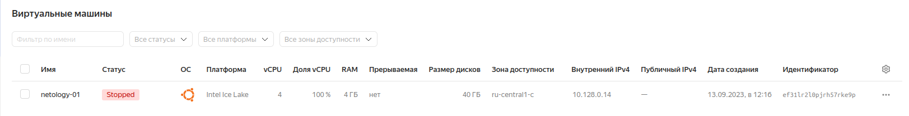
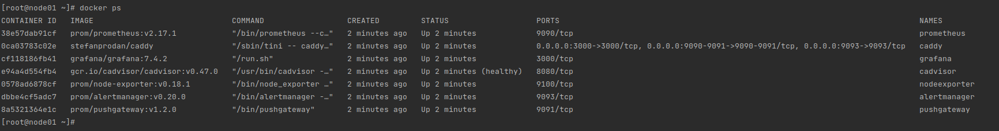

# Домашнее задание к занятию 4. «Оркестрация группой Docker-контейнеров на примере Docker Compose»

## Как сдавать задания

Обязательны к выполнению задачи без звёздочки. Их нужно выполнить, чтобы получить зачёт и диплом о профессиональной переподготовке.

Задачи со звёздочкой (*) — это дополнительные задачи и/или задачи повышенной сложности. Их выполнять не обязательно, но они помогут вам глубже понять тему.

Домашнее задание выполните в файле readme.md в GitHub-репозитории. В личном кабинете отправьте на проверку ссылку на .md-файл в вашем репозитории.

Любые вопросы по решению задач задавайте в чате учебной группы.

---


## Важно

Перед отправкой работы на проверку удаляйте неиспользуемые ресурсы.
Это нужно, чтобы не расходовать средства, полученные в результате использования промокода.

Подробные рекомендации [здесь](https://github.com/netology-code/virt-homeworks/blob/virt-11/r/README.md).

---

## Задача 1

Создайте собственный образ любой операционной системы (например, debian-11) с помощью Packer версии 1.5.0 ([инструкция](https://cloud.yandex.ru/docs/tutorials/infrastructure-management/packer-quickstart)).

Чтобы получить зачёт, вам нужно предоставить скриншот страницы с созданным образом из личного кабинета YandexCloud.

## Решение:
**Yandex.Cloud**

Установим Yandex.Cloud CLI и проверим версию:

```bash
curl https://storage.yandexcloud.net/yandexcloud-yc/install.sh | /bin/bash
yc --version
Yandex Cloud CLI 0.110.0 linux/amd64
```
Инициализируем профиль, сеть и подсеть:
```bash
yc init
Welcome! This command will take you through the configuration process.
Pick desired action:
 [1] Re-initialize this profile 'netology' with new settings 
 [2] Create a new profile
 [3] Switch to and re-initialize existing profile: 'default'
Please enter your numeric choice: 3
Please go to https://oauth.yandex.ru/authorize?response_type=token&client_id=1a6990aa636648e9b2ef855fa7bec2fb in order to obtain OAuth token.

Please enter OAuth token: [y0_AgAAAAABDtT******************************ZYFJPiBLB5l1Jw] y0_AgAAAAXxXxxxxxxxxxxxxxxxxxxxxXxxxxxxxxx
You have one cloud available: 'cloud-dreamhack2006' (id = b1gjfikdensqa79826s6). It is going to be used by default.
Please choose folder to use:
 [1] default (id = b1gtnr26lsnrkmj1um83)
 [2] Create a new folder
Please enter your numeric choice: 2
Please enter a folder name: netology
Your current folder has been set to 'netology' (id = b1g3kg715a6n9cf1ncqj).
Do you want to configure a default Compute zone? [Y/n] Y
Which zone do you want to use as a profile default?
 [1] ru-central1-a
 [2] ru-central1-b
 [3] ru-central1-c
 [4] Don't set default zone
Please enter your numeric choice: 1
Your profile default Compute zone has been set to 'ru-central1-a'.
```
```bash
yc config list 
token: y0_AgAAXxxxxxXxxxxxxxxxxxxXXXXXXXXXxxxx
cloud-id: b1gjfikdensqa79826s6
folder-id: b1g3kg715a6n9cf1ncqj
compute-default-zone: ru-central1-a
```
```bash
yc vpc network create --name net --labels my-label=netology --description "my first network via yc"
id: enp7tsppb92ur9c6k4a1
folder_id: b1g3kg715a6n9cf1ncqj
created_at: "2023-09-16T17:31:27Z"
name: net
description: my first network via yc
labels:
  my-label: netology
default_security_group_id: enpv3str11rakbcp49hm
```
```bash
yc vpc subnet create --name my-subnet-a --zone ru-central1-a --range 10.1.2.0/24 --network-name net --description "my first subnet via yc"
id: e9bpq66gfatd0i26klhn
folder_id: b1g3kg715a6n9cf1ncqj
created_at: "2023-09-16T17:32:19Z"
name: my-subnet-a
description: my first subnet via yc
network_id: enp7tsppb92ur9c6k4a1
zone_id: ru-central1-a
v4_cidr_blocks:
  - 10.1.2.0/24
```
**Packer**
```bash
sudo mv ~/Downloads/packer /usr/local/bin/
pavel@ubuntu:~/Downloads$ packer --version
1.5.0
Для установки плагина Yandex Compute Builder пришлось поднять версию packer до 1.9.4
```bash
packer init /home/pavel/yc/config.pkr.hcl 
Installed plugin github.com/hashicorp/yandex v1.1.2 in "/home/pavel/.packer.d/plugins/github.com/hashicorp/yandex/packer-plugin-yandex_v1.1.2_x5.0_linux_amd64"
```
Настроим конфигурационный файл [centos-7-base.json](src/packer/centos-7-base.json) и запустим создание образа:
```bash
yc config list
yc vpc subnet list
Где:
    token — OAuth-токен для аккаунта на Яндексе или IAM-токен для федеративного аккаунта.
    folder_id — идентификатор каталога, в котором будет создана ВМ и ее образ.
    subnet_id — идентификатор подсети, в которой будет создана ВМ и ее образ.
packer build centos-7-base.json 
yandex: output will be in this color.

==> yandex: Creating temporary RSA SSH key for instance...
==> yandex: Using as source image: fd85qh2iveusn11jcup6 (name: "centos-7-v20230911", family: "centos-7")
==> yandex: Use provided subnet id e9bpq66gfatd0i26klhn
==> yandex: Creating disk...
==> yandex: Creating instance...
==> yandex: Waiting for instance with id fhm1lc1k17vhd72ltn6d to become active...
    yandex: Detected instance IP: 158.160.105.238
==> yandex: Using SSH communicator to connect: 158.160.105.238
==> yandex: Waiting for SSH to become available...
==> yandex: Connected to SSH!
==> yandex: Provisioning with shell script: /tmp/packer-shell3731381348
    yandex: Loaded plugins: fastestmirror
    yandex: Loading mirror speeds from cached hostfile
    yandex:  * base: mirror.docker.ru
    yandex:  * extras: mirror.docker.ru
    yandex:  * updates: mirrors.datahouse.ru
    yandex: No packages marked for update
    yandex: Loaded plugins: fastestmirror
    yandex: Loading mirror speeds from cached hostfile
    yandex:  * base: mirror.docker.ru
    yandex:  * extras: mirror.docker.ru
    yandex:  * updates: mirrors.datahouse.ru
    yandex: Package iptables-1.4.21-35.el7.x86_64 already installed and latest version
    yandex: Package curl-7.29.0-59.el7_9.1.x86_64 already installed and latest version
    yandex: Package net-tools-2.0-0.25.20131004git.el7.x86_64 already installed and latest version
    yandex: Package rsync-3.1.2-12.el7_9.x86_64 already installed and latest version
    yandex: Package openssh-server-7.4p1-23.el7_9.x86_64 already installed and latest version
    yandex: Resolving Dependencies
    yandex: --> Running transaction check
    yandex: ---> Package bind-utils.x86_64 32:9.11.4-26.P2.el7_9.14 will be installed
    yandex: --> Processing Dependency: bind-libs-lite(x86-64) = 32:9.11.4-26.P2.el7_9.14 for package: 32:bind-utils-9.11.4-26.P2.el7_9.14.x86_64
    yandex: --> Processing Dependency: bind-libs(x86-64) = 32:9.11.4-26.P2.el7_9.14 for package: 32:bind-utils-9.11.4-26.P2.el7_9.14.x86_64
    yandex: --> Processing Dependency: liblwres.so.160()(64bit) for package: 32:bind-utils-9.11.4-26.P2.el7_9.14.x86_64
    yandex: --> Processing Dependency: libisccfg.so.160()(64bit) for package: 32:bind-utils-9.11.4-26.P2.el7_9.14.x86_64
    yandex: --> Processing Dependency: libisc.so.169()(64bit) for package: 32:bind-utils-9.11.4-26.P2.el7_9.14.x86_64
    yandex: --> Processing Dependency: libirs.so.160()(64bit) for package: 32:bind-utils-9.11.4-26.P2.el7_9.14.x86_64
    yandex: --> Processing Dependency: libdns.so.1102()(64bit) for package: 32:bind-utils-9.11.4-26.P2.el7_9.14.x86_64
    yandex: --> Processing Dependency: libbind9.so.160()(64bit) for package: 32:bind-utils-9.11.4-26.P2.el7_9.14.x86_64
    yandex: --> Processing Dependency: libGeoIP.so.1()(64bit) for package: 32:bind-utils-9.11.4-26.P2.el7_9.14.x86_64
    yandex: ---> Package bridge-utils.x86_64 0:1.5-9.el7 will be installed
    yandex: ---> Package tcpdump.x86_64 14:4.9.2-4.el7_7.1 will be installed
    yandex: --> Processing Dependency: libpcap >= 14:1.5.3-10 for package: 14:tcpdump-4.9.2-4.el7_7.1.x86_64
    yandex: --> Processing Dependency: libpcap.so.1()(64bit) for package: 14:tcpdump-4.9.2-4.el7_7.1.x86_64
    yandex: ---> Package telnet.x86_64 1:0.17-66.el7 will be installed
    yandex: --> Running transaction check
    yandex: ---> Package GeoIP.x86_64 0:1.5.0-14.el7 will be installed
    yandex: --> Processing Dependency: geoipupdate for package: GeoIP-1.5.0-14.el7.x86_64
    yandex: ---> Package bind-libs.x86_64 32:9.11.4-26.P2.el7_9.14 will be installed
    yandex: --> Processing Dependency: bind-license = 32:9.11.4-26.P2.el7_9.14 for package: 32:bind-libs-9.11.4-26.P2.el7_9.14.x86_64
    yandex: ---> Package bind-libs-lite.x86_64 32:9.11.4-26.P2.el7_9.14 will be installed
    yandex: ---> Package libpcap.x86_64 14:1.5.3-13.el7_9 will be installed
    yandex: --> Running transaction check
    yandex: ---> Package bind-license.noarch 32:9.11.4-26.P2.el7_9.14 will be installed
    yandex: ---> Package geoipupdate.x86_64 0:2.5.0-2.el7 will be installed
    yandex: --> Finished Dependency Resolution
    yandex:
    yandex: Dependencies Resolved
    yandex:
    yandex: ================================================================================
    yandex:  Package            Arch       Version                        Repository   Size
    yandex: ================================================================================
    yandex: Installing:
    yandex:  bind-utils         x86_64     32:9.11.4-26.P2.el7_9.14       updates     262 k
    yandex:  bridge-utils       x86_64     1.5-9.el7                      base         32 k
    yandex:  tcpdump            x86_64     14:4.9.2-4.el7_7.1             base        422 k
    yandex:  telnet             x86_64     1:0.17-66.el7                  updates      64 k
    yandex: Installing for dependencies:
    yandex:  GeoIP              x86_64     1.5.0-14.el7                   base        1.5 M
    yandex:  bind-libs          x86_64     32:9.11.4-26.P2.el7_9.14       updates     158 k
    yandex:  bind-libs-lite     x86_64     32:9.11.4-26.P2.el7_9.14       updates     1.1 M
    yandex:  bind-license       noarch     32:9.11.4-26.P2.el7_9.14       updates      92 k
    yandex:  geoipupdate        x86_64     2.5.0-2.el7                    updates      35 k
    yandex:  libpcap            x86_64     14:1.5.3-13.el7_9              updates     139 k
    yandex:
    yandex: Transaction Summary
    yandex: ================================================================================
    yandex: Install  4 Packages (+6 Dependent packages)
    yandex:
    yandex: Total download size: 3.8 M
    yandex: Installed size: 9.0 M
    yandex: Downloading packages:
    yandex: --------------------------------------------------------------------------------
    yandex: Total                                               12 MB/s | 3.8 MB  00:00
    yandex: Running transaction check
    yandex: Running transaction test
    yandex: Transaction test succeeded
    yandex: Running transaction
    yandex:   Installing : 32:bind-license-9.11.4-26.P2.el7_9.14.noarch                1/10
    yandex:   Installing : geoipupdate-2.5.0-2.el7.x86_64                              2/10
    yandex:   Installing : GeoIP-1.5.0-14.el7.x86_64                                   3/10
    yandex:   Installing : 32:bind-libs-lite-9.11.4-26.P2.el7_9.14.x86_64              4/10
    yandex:   Installing : 32:bind-libs-9.11.4-26.P2.el7_9.14.x86_64                   5/10
    yandex:   Installing : 14:libpcap-1.5.3-13.el7_9.x86_64                            6/10
    yandex: pam_tally2: Error opening /var/log/tallylog for update: Permission denied
    yandex: pam_tally2: Authentication error
    yandex: useradd: failed to reset the tallylog entry of user "tcpdump"
    yandex:   Installing : 14:tcpdump-4.9.2-4.el7_7.1.x86_64                           7/10
    yandex:   Installing : 32:bind-utils-9.11.4-26.P2.el7_9.14.x86_64                  8/10
    yandex:   Installing : bridge-utils-1.5-9.el7.x86_64                               9/10
    yandex:   Installing : 1:telnet-0.17-66.el7.x86_64                                10/10
    yandex:   Verifying  : 32:bind-libs-lite-9.11.4-26.P2.el7_9.14.x86_64              1/10
    yandex:   Verifying  : GeoIP-1.5.0-14.el7.x86_64                                   2/10
    yandex:   Verifying  : 32:bind-utils-9.11.4-26.P2.el7_9.14.x86_64                  3/10
    yandex:   Verifying  : 32:bind-license-9.11.4-26.P2.el7_9.14.noarch                4/10
    yandex:   Verifying  : 14:libpcap-1.5.3-13.el7_9.x86_64                            5/10
    yandex:   Verifying  : geoipupdate-2.5.0-2.el7.x86_64                              6/10
    yandex:   Verifying  : 1:telnet-0.17-66.el7.x86_64                                 7/10
    yandex:   Verifying  : 14:tcpdump-4.9.2-4.el7_7.1.x86_64                           8/10
    yandex:   Verifying  : bridge-utils-1.5-9.el7.x86_64                               9/10
    yandex:   Verifying  : 32:bind-libs-9.11.4-26.P2.el7_9.14.x86_64                  10/10
    yandex:
    yandex: Installed:
    yandex:   bind-utils.x86_64 32:9.11.4-26.P2.el7_9.14   bridge-utils.x86_64 0:1.5-9.el7
    yandex:   tcpdump.x86_64 14:4.9.2-4.el7_7.1            telnet.x86_64 1:0.17-66.el7
    yandex:
    yandex: Dependency Installed:
    yandex:   GeoIP.x86_64 0:1.5.0-14.el7
    yandex:   bind-libs.x86_64 32:9.11.4-26.P2.el7_9.14
    yandex:   bind-libs-lite.x86_64 32:9.11.4-26.P2.el7_9.14
    yandex:   bind-license.noarch 32:9.11.4-26.P2.el7_9.14
    yandex:   geoipupdate.x86_64 0:2.5.0-2.el7
    yandex:   libpcap.x86_64 14:1.5.3-13.el7_9
    yandex:
    yandex: Complete!
==> yandex: Stopping instance...
==> yandex: Deleting instance...
    yandex: Instance has been deleted!
==> yandex: Creating image: centos-7-base
==> yandex: Waiting for image to complete...
==> yandex: Success image create...
==> yandex: Destroying boot disk...
    yandex: Disk has been deleted!
Build 'yandex' finished after 2 minutes 18 seconds.

==> Wait completed after 2 minutes 18 seconds

==> Builds finished. The artifacts of successful builds are:
--> yandex: A disk image was created: centos-7-base (id: fd845t3kv00g21rm9ueg) with family name centos
yc compute image list
+----------------------+---------------+--------+----------------------+--------+
|          ID          |     NAME      | FAMILY |     PRODUCT IDS      | STATUS |
+----------------------+---------------+--------+----------------------+--------+
| fd845t3kv00g21rm9ueg | centos-7-base | centos | f2ecrlmsarobl83b08mf | READY  |
+----------------------+---------------+--------+----------------------+--------+
```

## Задача 2
**2.1.** Создайте вашу первую виртуальную машину в YandexCloud с помощью web-интерфейса YandexCloud.        

**2.2.*** **(Необязательное задание)**      
Создайте вашу первую виртуальную машину в YandexCloud с помощью Terraform (вместо использования веб-интерфейса YandexCloud).
Используйте Terraform-код в директории ([src/terraform](https://github.com/netology-group/virt-homeworks/tree/virt-11/05-virt-04-docker-compose/src/terraform)).

Чтобы получить зачёт, вам нужно предоставить вывод команды terraform apply и страницы свойств, созданной ВМ из личного кабинета YandexCloud.
## Решение:
В интерфейсе Яндекс Облака создадим сервисный аккаунт `srv-test`. Для этого аккаунта создадим ключ авторизации:
```bash
yc iam key create --folder-name netology --service-account-name srv-test --output key.json
id: ajeu7di6fu07jo1dd309
service_account_id: ajeeliic1himpbtij0tv
created_at: "2023-09-17T09:43:53.256811172Z"
key_algorithm: RSA_2048
```
```bash
yc config profile create srv-test-profile
Profile 'srv-test-profile' created and activated
```
```bash
yc config profile list
default
netology
srv-test-profile ACTIVE
```
```bash
yc config set service-account-key key.json
terraform providers lock -net-mirror=https://terraform-mirror.yandexcloud.net -platform=linux_amd64 -platform=darwin_arm64 yandex-cloud/yandex
```
```bash
terraform plan
terraform apply
yandex_compute_instance.node01: Creating...
yandex_compute_instance.node01: Still creating... [10s elapsed]
yandex_compute_instance.node01: Still creating... [20s elapsed]
yandex_compute_instance.node01: Still creating... [30s elapsed]
yandex_compute_instance.node01: Still creating... [40s elapsed]
yandex_compute_instance.node01: Still creating... [50s elapsed]
yandex_compute_instance.node01: Creation complete after 56s [id=fhmbrhguobbj5dskt1bu]
```

## Задача 3

С помощью Ansible и Docker Compose разверните на виртуальной машине из предыдущего задания систему мониторинга на основе Prometheus/Grafana.
Используйте Ansible-код в директории ([src/ansible](https://github.com/netology-group/virt-homeworks/tree/virt-11/05-virt-04-docker-compose/src/ansible)).

Чтобы получить зачёт, вам нужно предоставить вывод команды "docker ps" , все контейнеры, описанные в [docker-compose](https://github.com/netology-group/virt-homeworks/blob/virt-11/05-virt-04-docker-compose/src/ansible/stack/docker-compose.yaml),  должны быть в статусе "Up".
## Решение:

## Задача 4

1. Откройте веб-браузер, зайдите на страницу http://<внешний_ip_адрес_вашей_ВМ>:3000.
2. Используйте для авторизации логин и пароль из [.env-file](https://github.com/netology-group/virt-homeworks/blob/virt-11/05-virt-04-docker-compose/src/ansible/stack/.env).
3. Изучите доступный интерфейс, найдите в интерфейсе автоматически созданные docker-compose-панели с графиками([dashboards](https://grafana.com/docs/grafana/latest/dashboards/use-dashboards/)).
4. Подождите 5-10 минут, чтобы система мониторинга успела накопить данные.
## Решение:


