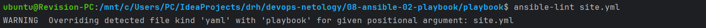
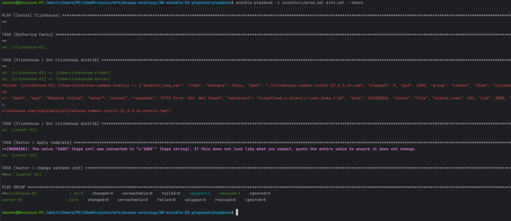
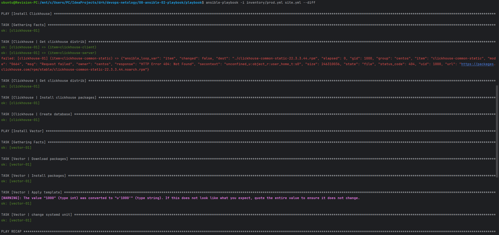
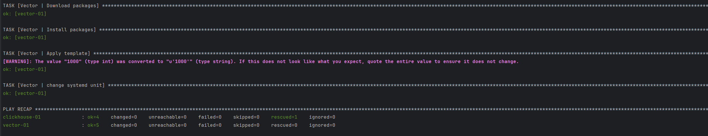
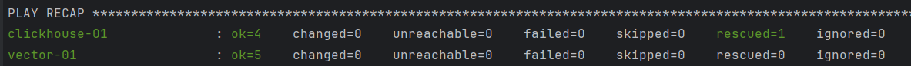

# Домашнее задание к занятию 2 «Работа с Playbook»
Данный плейбук предназначен для установки `Clickhouse` и `Vector` на хосты, указанные в `inventory` файле.

## group_vars

| Переменная  | Назначение  |
|:---|:---|
| `clickhouse_version` | версия `Clickhouse` |
| `clickhouse_packages` | `RPM` пакеты `Clickhouse`, которые необходимо скачать |
| `vector_url` | URL адрес для скачивания `RPM` пакетов `Vector` |
| `vector_version` | версия `Vector` |
| `vector_config_dir` | каталог для конфига `vector` |
| `vector_config` | конфиг файл `vector`. При использовании данного конфига `vector` генерирует демо-логи в формате `syslog` и отправляет их на хост `clickhouse` (БД `logs`, таблица `vector_table`) |

## Inventory файл

Группа "Clickhouse" состоит из 1 хоста `clickhouse-01`

Группа "vector" состоит из 1 хоста `vector-01`

## Playbook

Playbook состоит из 2 `play`.

Play "Install Clickhouse" применяется на группу хостов "Clickhouse" и предназначен для установки и запуска `Clickhouse`

Объявляем `handler` для запуска `clickhouse-server`.
```yaml
handlers:
    - name: Start clickhouse service
      become: true
      ansible.builtin.service:
        name: clickhouse-server
        state: restarted
```

| Имя таска | Описание |
|--------------|---------|
| `Clickhouse \| Get clickhouse distrib` | Скачивание `RPM` пакетов. Используется цикл с перменными `clickhouse_packages`. Так как не у всех пакетов есть `noarch` версии, используем перехват ошибки `rescue` |
| `Clickhouse \| Install clickhouse packages` | Установка `RPM` пакетов. Используем `disable_gpg_check: true` для отключения проверки GPG подписи пакетов. В `notify` указываем, что данный таск требует запуск handler `Start clickhouse service` |
| `Clickhouse \| Flush handlers` | Форсируем применение handler `Start clickhouse service`. Это необходимо для того, чтобы handler выполнился на текущем этапе, а не по завершению тасок. Если его не запустить сейчас, то сервис не будет запущен и следующий таск завершится с ошибкой |
| `Clickhouse \| Create database` | Создаем в `Clickhouse` БД с названием "logs". Также прописываем условия, при которых таск будет иметь состояние `failed` и `changed` |

Play "Install Vector" применяется на группу хостов "Vector" и предназначен для установки и запуска `Vector`

Объявляем `handler` для запуска `vector`.
```yaml
  handlers:
    - name: Start Vector service
      become: true
      ansible.builtin.service:
        name: vector
        state: restarted
```

| Имя таска | Описание |
|--------------|---------|
| `Vector \| Download packages` | Скачивание `RPM` пакетов в текущую директорию пользователя |
| `Vector \| Install packages` | Установка `RPM` пакетов. Используем `disable_gpg_check: true` для отключения проверки GPG подписи пакетов |
| `Vector \| Apply template` | Применяем шаблон конфига `vector`. Здесь мы задаем путь конфига. Владельцем назначаем текущего пользователя `ansible`. После применения запускаем валидацию конфига |
| `Vector \| change systemd unit` | Изменяем модуль службы `vector`. После этого указываем handler для старта службы `vector` |

## Template

Шаблон "vector.service.j2" используется для изменения модуля службы `vector`. В нем мы определяем строку запуска `vector`. Также указываем, что unit должен быть запущен под текущим пользователем `ansible`

Шаблон "vector.yml.j2" используется для настройки конфига `vector`. В нем мы указываем, что конфиг файл находится в переменной "vector_config" и его надо преобразовать в `YAML`.

## 5-8




