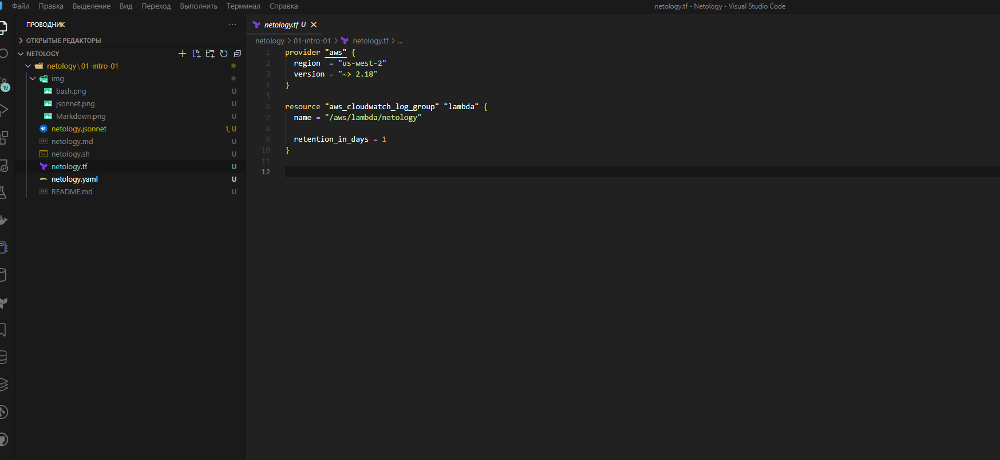
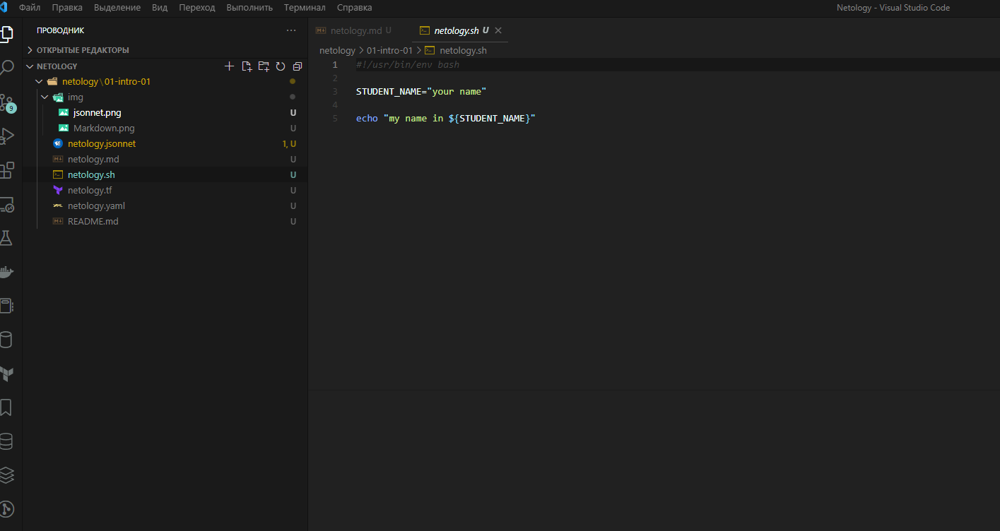
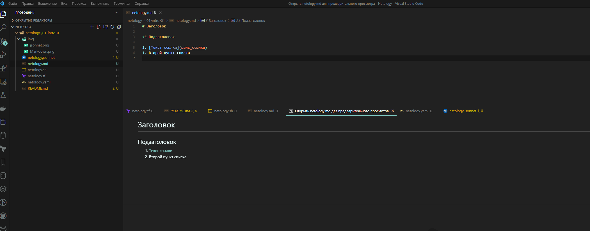
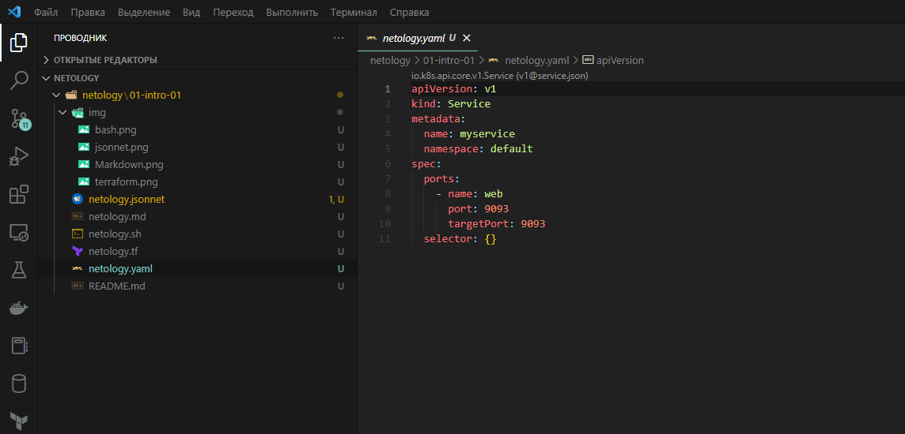
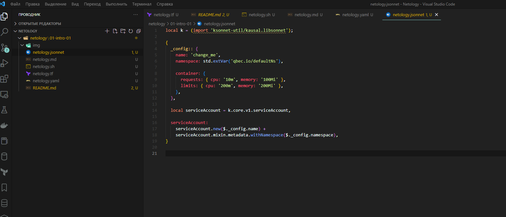

 ## Задание №1
 - Terraform: 
 - Bash: 
 - Markdown: 
 - Yaml: 
 - Jsonnet: 

## Задание №2
#Решение задачи
1. Product Manager - собирает требования с заказчиков которые нужны для разработки нового функционала, заводит задачу на разработку(возможно в паре с аналитиком)
2. Команда разработки - Берет эту задачу в работу, после выполнения передают на рэвью лидам, а лиды после рэвью, на тестирование.
3. Тестировщик - Берет эту задачу и начинает тестировать её, выкатив предварительно это на тестовые среды, запустив пайплайны с отдельных брэнчей с этой доработкой. После завершения тестирования, PM может показать заказчику проделанную работу, собирает фидбэк и если что то нужно изменить, отдаёт её на доработку.
4. DevOps-инженер - Отвечает за процессы CI/CD в команде, его задача чтобы работали все среды(test,dev,stage,prod), сервер с VCS, вся инфра с оркестратором и прочим. А так же как можно больше сократить время от написания кода разработчиками, до выдачи его заказчику/клиентам, на пром и тд.
5. Если все эти условия были соблюдены и заказчику нравится новый функционал, задача переходит в статус Выполнено и цилк завершается.
