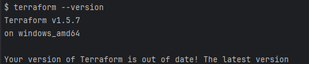
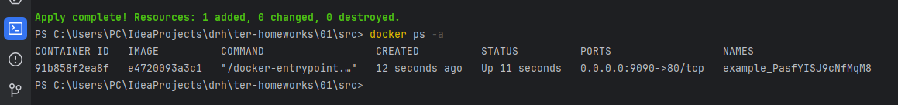
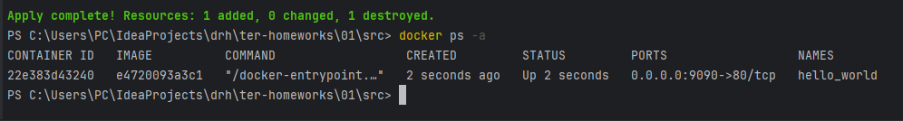
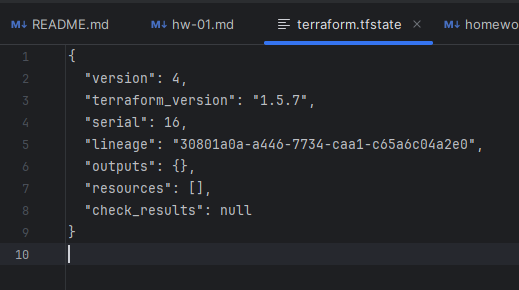

1.

---
2. personal.auto.tfvars
---
3. "result": "PasfYISJ9cNfMqM8"
---
4. В строке name = "example_${random_password.random_string_FAKE.resulT}" использован неправильный синтаксис переменной. Ошибка в имени ресурса. Вместо resource "docker_container" "1nginx" надо resource "docker_container" "nginx" блок resource "docker_image" не содержит имя ресурса
___
5.

---
6.

terraform apply -auto-approve - при использовании ключа apply выполняется сразу подтверждения.
---
7. 

8. Образ не был удален, так как была использована опция -keep_locally
keep_locally (Boolean) If true, then the Docker image won't be deleted on destroy operation. If this is false, it will delete the image from the docker local storage on destroy operation.