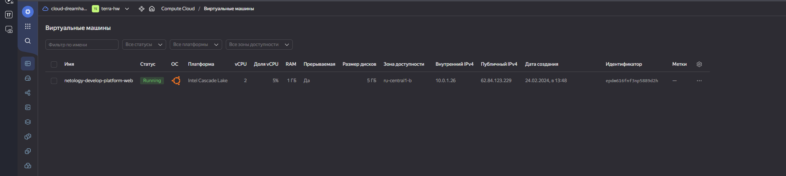

# ter-homeworks-02
## Задание 1
Ошибки:
cores = 1 - платформа не дает установить такое количество ядер, минимум 2 и далее кратное двум.
platform_id = "standart-v4" - такой платформы не существует, для standart только v1,v2,v3.
service_account_key_file = file("~/.authorized_key.json") - здесь необходимо указать имя файла заданное при формировании iam ключа,так же указать путь куда мы его положили.

```sh
$ ssh ubuntu@62.84.123.229
The authenticity of host '62.84.123.229 (62.84.123.229)' can't be established.
ED25519 key fingerprint is SHA256:QL/rv3iz8Wl6yc2HAGzRNrDftWBN0GmGb5LgF05midU.
This key is not known by any other names.
Are you sure you want to continue connecting (yes/no/[fingerprint])? yes
Warning: Permanently added '62.84.123.229' (ED25519) to the list of known hosts.
Welcome to Ubuntu 20.04.6 LTS (GNU/Linux 5.4.0-171-generic x86_64)

 * Documentation:  https://help.ubuntu.com
 * Management:     https://landscape.canonical.com
 * Support:        https://ubuntu.com/pro

The programs included with the Ubuntu system are free software;
the exact distribution terms for each program are described in the
individual files in /usr/share/doc/*/copyright.

Ubuntu comes with ABSOLUTELY NO WARRANTY, to the extent permitted by
applicable law.

To run a command as administrator (user "root"), use "sudo <command>".
See "man sudo_root" for details.

ubuntu@epdm616fnf3np5889d2h:~$ curl ifconfig.me
62.84.123.229ubuntu@epdm616fnf3np5889d2h:~$ 
```
Ответьте, как в процессе обучения могут пригодиться параметры preemptible = true и core_fraction=5 в параметрах ВМ.

preemptible = true - Прерываемая ВМ, может быть выключена провайдером в любой момент или через сутки. При обучении помогает хорошо экономить деньги на балансе.

core_fraction=5 - Процент от производительности CPU, так же позволяет сэкономить, когда не требуется высокая проиизводительность от машины.
## Задание 2
after terraform plan
```shell
Plan: 3 to add, 0 to change, 0 to destr
```
```shell
###new vars
variable "vm_web_name" {
  type = string
  default = "netology-develop-platform-web"
  }

variable "vm_web_image" {
  type = string
  default = "ubuntu-2004-lts"
}

variable "vm_web_platform_id" {
  type = string
  default = "standard-v2"
  }

variable "vm_web_cores" {
  type = number
  default = 2
  }

variable "vm_web_memory" {
    type = number
    default = 1  
  }

variable "vm_web_fract" {
    type = number
    default = 5
  }

variable "vm_web_prmt" {
  type = bool
  default = true
  }

variable "vm_web_nat" {
  type = bool
  default = true
  }

variable "vm_web_sp" {
  type = bool
  default = true
  }
```
## Задание 3

### main.tf:
```shell
resource "yandex_vpc_network" "develop" {
  name = var.vpc_name
}
resource "yandex_vpc_subnet" "develop" {
  name           = var.vpc_name
  zone           = var.default_zone
  network_id     = yandex_vpc_network.develop.id
  v4_cidr_blocks = var.default_cidr
}
resource "yandex_vpc_subnet" "develop2" {
  name           = var.vm_db_vpc_name
  zone           = var.vm_db_zone
  network_id     = yandex_vpc_network.develop.id
  v4_cidr_blocks = var.vm_db_cidr
}


data "yandex_compute_image" "ubuntu" {
  family = var.vm_web_image
}
resource "yandex_compute_instance" "platform" {
  name        = var.vm_web_name
  platform_id = var.vm_web_platform_id
  resources {
    cores         = var.vm_web_cores
    memory        = var.vm_web_memory
    core_fraction = var.vm_web_fract
  }
  boot_disk {
    initialize_params {
      image_id = data.yandex_compute_image.ubuntu.image_id
    }
  }
  scheduling_policy {
    preemptible = var.vm_web_prmt
  }
  network_interface {
    subnet_id = yandex_vpc_subnet.develop.id
    nat       = var.vm_web_nat
  }

  metadata = {
    serial-port-enable = var.vm_web_sp
    ssh-keys           = "ubuntu:${var.vms_ssh_root_key}"
  }

}
###netology-develop-platform-db
resource "yandex_compute_instance" "platform2" {
  name        = var.vm_db_name
  platform_id = var.vm_db_platform_id
  zone           = var.vm_db_zone

  resources {
    cores         = var.vm_db_cores
    memory        = var.vm_db_memory
    core_fraction = var.vm_db_fract
  }
  boot_disk {
    initialize_params {
      image_id = data.yandex_compute_image.ubuntu.image_id
    }
  }
  scheduling_policy {
    preemptible = var.vm_db_prmt
  }
  network_interface {
    subnet_id = yandex_vpc_subnet.develop2.id
    nat       = var.vm_db_nat
  }

  metadata = {
    serial-port-enable = var.vm_db_sp
    ssh-keys           = "ubuntu:${var.vms_ssh_root_key}"
  }

}
```
### vms_platform.tf:
```shell
###cloud vars

variable "vm_db_zone" {
  type        = string
  default     = "ru-central1-b"
  description = "https://cloud.yandex.ru/docs/overview/concepts/geo-scope"
}
variable "vm_db_vpc_name" {
  type        = string
  default     = "develop2"
  description = "VPC network & subnet name"
}
variable "vm_db_cidr" {
  type        = list(string)
  default     = ["192.168.0.0/24"]
  description = "https://cloud.yandex.ru/docs/vpc/operations/subnet-create"
}
variable "vm_db_name" {
  type = string
  default = "netology-develop-platform-db"
}

variable "vm_db_image" {
  type = string
  default = "ubuntu-2004-lts"
}
variable "vm_db_platform_id" {
  type = string
  default = "standard-v1"
}

variable "vm_db_cores" {
type = number
default = 2
}
variable "vm_db_memory" {
  type = number
  default = 2
}
variable "vm_db_fract" {
  type = number
  default = 5
}
variable "vm_db_prmt" {
  type = bool
  default = true
}
variable "vm_db_nat" {
  type = bool
  default = true
}

variable "vm_db_sp" {
  type = bool
  default = true
  }
```
## Задание 4
```shell
$ terraform output
all = [
  {
    "platform" = [
      "netology-develop-platform-web",
      "178.154.204.51",
      "fhm0uhho2es888dnof3a.auto.internal",
    ]
  },
  {
    "platform2" = [
      "netology-develop-platform-db",
      "158.160.84.99",
      "epdo0qtso3qe0539slj2.auto.internal",
    ]
  },
]
```
```shell
output "all" {
  value = [
    { platform = [
      yandex_compute_instance.platform.name, yandex_compute_instance.platform.network_interface[0].nat_ip_address,
      yandex_compute_instance.platform.fqdn]},

    { platform2 = [
      yandex_compute_instance.platform2.name, yandex_compute_instance.platform2.network_interface[0].nat_ip_address,
      yandex_compute_instance.platform2.fqdn]}

  ]
}

```
## Задание 5
### Файл locals.tf:
```shell
locals {
  mashine_name1 ="${yandex_vpc_subnet.develop1.zone}-${var.vm_web_name}"
  mashine_name2 ="${yandex_vpc_subnet.develop2.zone}-${var.vm_db_name}"
}
```
### Результат:

## Задание 6
### 1
```shell
variable "vms_resources" {
  default     = {
    web ={cores ="2",memory ="1",core_fraction ="5"},
    db = {cores ="2",memory ="2",core_fraction ="5"}
  }
}
```
### 2
```shell
variable "meta" {
  default = {ssh_key="ssh-ed25519 AAAAC3NzaC1lZDI1NTE5AAAAIJ4jYXGZJCUTbp+lme1i71RiraiMK6Kmf1lVEE9IbrYu Pavel Chvanin",
    sp_e="1"
  }
}
```