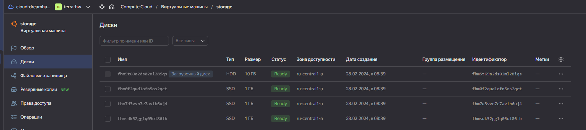

## Задание 1


---
## Задание 2
```shell
yandex_vpc_network.develop: Creating...
yandex_vpc_network.develop: Creation complete after 2s [id=enpanc5mtlono37mvqhi]
yandex_vpc_subnet.develop: Creating...
yandex_vpc_security_group.example: Creating...
yandex_vpc_subnet.develop: Creation complete after 1s [id=e9b8ms248jh4r4vv3216]
yandex_vpc_security_group.example: Creation complete after 3s [id=enpt0uhrklv9mhoc4223]
yandex_compute_instance.WM-count[0]: Creating...
yandex_compute_instance.WM-count[1]: Creating...
yandex_compute_instance.WM-count[1]: Still creating... [10s elapsed]
yandex_compute_instance.WM-count[0]: Still creating... [10s elapsed]
yandex_compute_instance.WM-count[0]: Still creating... [20s elapsed]
yandex_compute_instance.WM-count[1]: Still creating... [20s elapsed]
yandex_compute_instance.WM-count[0]: Still creating... [30s elapsed]
yandex_compute_instance.WM-count[1]: Still creating... [30s elapsed]
yandex_compute_instance.WM-count[0]: Creation complete after 32s [id=fhmfi41nvomj1qf5n5jq]
yandex_compute_instance.WM-count[1]: Creation complete after 38s [id=fhmbqadpcsv8ucnqrr3f]
yandex_compute_instance.WM-fore_each["0"]: Creating...
yandex_compute_instance.WM-fore_each["1"]: Creating...
yandex_compute_instance.WM-fore_each["0"]: Still creating... [10s elapsed]
yandex_compute_instance.WM-fore_each["1"]: Still creating... [10s elapsed]
yandex_compute_instance.WM-fore_each["0"]: Still creating... [20s elapsed]
yandex_compute_instance.WM-fore_each["1"]: Still creating... [20s elapsed]
yandex_compute_instance.WM-fore_each["0"]: Still creating... [30s elapsed]
yandex_compute_instance.WM-fore_each["1"]: Still creating... [30s elapsed]
yandex_compute_instance.WM-fore_each["1"]: Creation complete after 30s [id=fhmp7cd44dofa0pf0irp]
yandex_compute_instance.WM-fore_each["0"]: Creation complete after 35s [id=fhmbn0e4au0881hsb21n]
```


---
## Задание 3


---
## Задание 4
```shell
null_resource.web_hosts_provision: Destroying... [id=7527610155670296608]
null_resource.web_hosts_provision: Destruction complete after 0s
null_resource.web_hosts_provision: Creating...
null_resource.web_hosts_provision: Provisioning with 'local-exec'...
null_resource.web_hosts_provision (local-exec): Executing: ["/bin/sh" "-c" "cat ~/.ssh/id_ed25519 | ssh-add -"]
null_resource.web_hosts_provision (local-exec): Identity added: (stdin) (Pavel Chvanin)
null_resource.web_hosts_provision: Provisioning with 'local-exec'...
null_resource.web_hosts_provision (local-exec): Executing: ["/bin/sh" "-c" "sleep 60"]
null_resource.web_hosts_provision: Still creating... [10s elapsed]
null_resource.web_hosts_provision: Still creating... [20s elapsed]
null_resource.web_hosts_provision: Still creating... [30s elapsed]
null_resource.web_hosts_provision: Still creating... [40s elapsed]
null_resource.web_hosts_provision: Still creating... [50s elapsed]
null_resource.web_hosts_provision: Still creating... [1m0s elapsed]
null_resource.web_hosts_provision: Provisioning with 'local-exec'...
null_resource.web_hosts_provision (local-exec): Executing: ["/bin/sh" "-c" "ansible-playbook -i /mnt/c/Users/PC/IdeaProjects/drh/devops-netology/ter-homeworks/03/src/inventory.cfg /mnt/c/Users/PC/IdeaProjects/drh/devops-netology
/ter-homeworks/03/src/playbook.yml"]
null_resource.web_hosts_provision (local-exec): [WARNING]: Found both group and host with same name: storage

null_resource.web_hosts_provision (local-exec): PLAY [test] ********************************************************************

null_resource.web_hosts_provision (local-exec): TASK [Install Nginx Web Server on Debian Family] *******************************
null_resource.web_hosts_provision: Still creating... [1m10s elapsed]
null_resource.web_hosts_provision: Still creating... [1m20s elapsed]
null_resource.web_hosts_provision: Still creating... [1m30s elapsed]
null_resource.web_hosts_provision (local-exec): changed: [replica]
null_resource.web_hosts_provision: Still creating... [1m40s elapsed]
null_resource.web_hosts_provision: Still creating... [1m50s elapsed]
null_resource.web_hosts_provision (local-exec): changed: [web-1]
null_resource.web_hosts_provision: Still creating... [2m0s elapsed]
null_resource.web_hosts_provision (local-exec): changed: [web-2]
null_resource.web_hosts_provision (local-exec): changed: [storage]
null_resource.web_hosts_provision (local-exec): changed: [main]

null_resource.web_hosts_provision (local-exec): PLAY RECAP *********************************************************************
null_resource.web_hosts_provision (local-exec): main                       : ok=1    changed=1    unreachable=0    failed=0    skipped=0    rescued=0    ignored=0
null_resource.web_hosts_provision (local-exec): replica                    : ok=1    changed=1    unreachable=0    failed=0    skipped=0    rescued=0    ignored=0
null_resource.web_hosts_provision (local-exec): storage                    : ok=1    changed=1    unreachable=0    failed=0    skipped=0    rescued=0    ignored=0
null_resource.web_hosts_provision (local-exec): web-1                      : ok=1    changed=1    unreachable=0    failed=0    skipped=0    rescued=0    ignored=0
null_resource.web_hosts_provision (local-exec): web-2                      : ok=1    changed=1    unreachable=0    failed=0    skipped=0    rescued=0    ignored=0

null_resource.web_hosts_provision: Creation complete after 2m5s [id=1685348412686893225]
```
```shell
root@fhmbqadpcsv8ucnqrr3f:~# systemctl status nginx
● nginx.service - A high performance web server and a reverse proxy server
     Loaded: loaded (/lib/systemd/system/nginx.service; enabled; vendor preset: enabled)
     Active: active (running) since Wed 2024-02-28 08:31:43 UTC; 16min ago
       Docs: man:nginx(8)
   Main PID: 3452 (nginx)
      Tasks: 3 (limit: 1085)
     Memory: 5.7M
     CGroup: /system.slice/nginx.service
             ├─3452 nginx: master process /usr/sbin/nginx -g daemon on; master_process on;
             ├─3453 nginx: worker process
             └─3454 nginx: worker process

Feb 28 08:31:43 fhmbqadpcsv8ucnqrr3f systemd[1]: Starting A high performance web server and a reverse proxy server...
Feb 28 08:31:43 fhmbqadpcsv8ucnqrr3f systemd[1]: Started A high performance web server and a reverse proxy server.
```